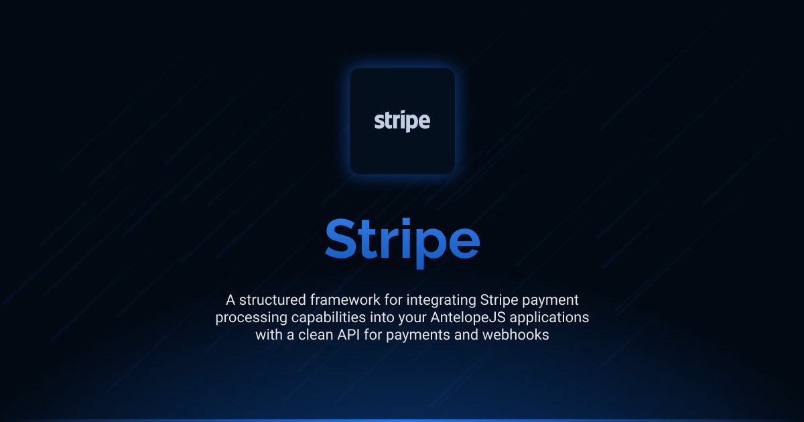

# Interface Stripe

<div align="center">
<a href="./LICENSE"></a>
<a href="https://discord.gg/sjK28QHrA7"></a>
<a href="./docs/1.introduction.md"></a>
</div>

A structured framework for integrating Stripe payment processing capabilities into your AntelopeJS applications. Interface Stripe offers a clean, simple API for creating payment intents, monitoring payment status changes, and processing webhooks.

## Installation

```bash
ajs module imports add stripe@beta
```

## Documentation

Detailed documentation is available in the `docs` directory:

- [Introduction](./docs/1.introduction.md) - Overview and basic concepts
- [Payment Processing](./docs/2.payment-processing.md) - Creating and managing payment intents
- [Event Monitoring](./docs/3.event-monitoring.md) - Watching payment events and status changes

## Current Status

This is the development version (`beta`) of the Interface Stripe. It is currently in pre-release stage and may undergo changes before the final release. The interface is not considered stable for production use without understanding that breaking changes may occur.

## Versions

| Version | Link                                                                                       | Status                                        |
| ------- | ------------------------------------------------------------------------------------------ | --------------------------------------------- |
| beta    | [stripe@beta](https://github.com/AntelopeJS/stripe/tree/main/output/stripe/beta) | Waiting validation from community to go in v1 |
| 1       | _Not yet released_                                                                         | Planned stable release                        |

## License

This project is licensed under the Apache License 2.0 - see the [LICENSE](LICENSE) file for details.
