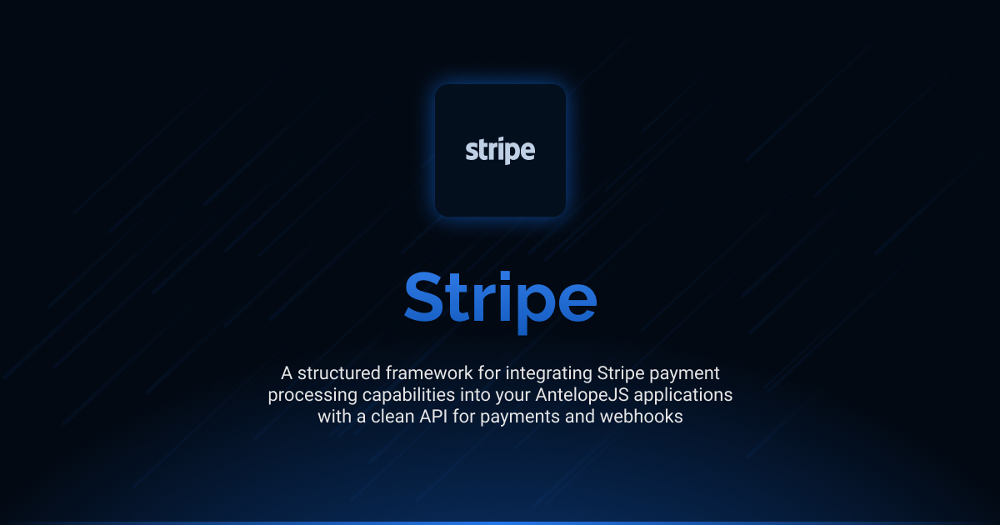

# Interface Stripe

<div align="center">
<a href="https://www.npmjs.com/package/@antelopejs/interface-stripe"></a>
<a href="./LICENSE"></a>
<a href="https://discord.gg/sjK28QHrA7"></a>
<a href="./docs/1.introduction.md"></a>
</div>

An AntelopeJS interface for integrating Stripe payment processing. It provides functions to create payment intents, complete payments with chargeable sources, and monitor payment status changes in real time across clustered environments.

## Installation

```bash
npm install @antelopejs/interface-stripe
```

## Documentation

Detailed documentation is available in the `docs` directory:

- [Introduction](./docs/1.introduction.md) - Overview and basic concepts
- [Payment Processing](./docs/2.payment-processing.md) - Creating and managing payment intents
- [Event Monitoring](./docs/3.event-monitoring.md) - Watching payment events and status changes

## License

This project is licensed under the Apache License 2.0 - see the [LICENSE](LICENSE) file for details.
